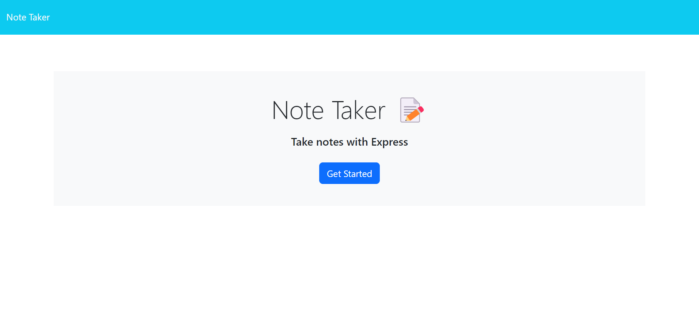
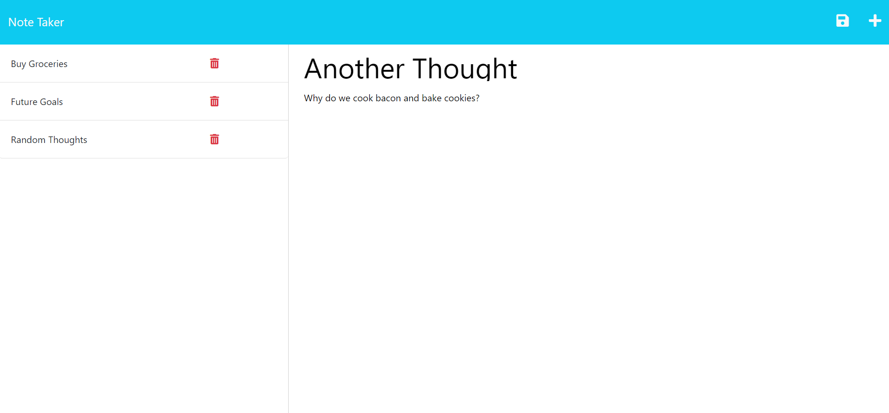

# Note Taker Web App

## Table of Contents

- [Description](#description)
- [Featues](#features)
- [Deployed App](#deployment)
- [Future Development](#future-development)
- [License](#license)

## Description

This web app was made to provide a place for taking notes and saving things for later. Each note includes a title and a main section for the bulk of text. All notes are saved and loaded again upon revisiting the web app. When you no longer need the note, you can delete it, to keep your list of notes clean.

## Features

- Save new notes after entering a Title and Text
- Review saved notes by clicking on titles
- Delete old notes by clicking the delete icon
- Persistence through closing and reload

## Deployment

This web app is currently deployed at [https://note-taker-web-app.herokuapp.com/](https://note-taker-web-app.herokuapp.com/)

## Future Development

- Allow for editing of notes
- Create different notebooks for organizing notes

## License

 Please refer to the [LICENSE](./LICENSE) in the repo.
